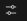
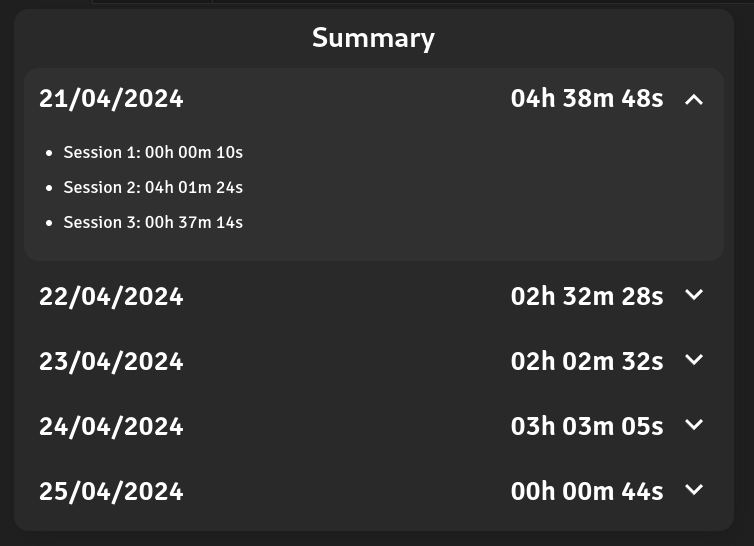
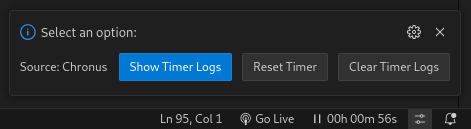

## Description

Enhance your time management and productivity with this extension. It assists you in tracking your coding sessions and maintaining focus on your work.

## Extension Settings

* **Pause Timer When Unfocused:** When enabled, the timer will automatically pause when VSCode loses focus.
* **Run On Startup:** When enabled, the timer will start automatically upon VSCode startup.

## Extension Functions

* **Start Timer:** Initiates time tracking.
* **Pause Timer:** Pauses time tracking.
* **Reset Timer:** Resets the timer to its initial value.
* **Clear Timer Records:** Deletes all the data from the records.
* **Show Timer Records:** Display overview of all recorded data. A new session is created everytime VSCode is started or when the timer reseted.

- Click on the timer to Start/Pause and on  to access the other options.

## Previews

\

## Known issues
* Rapidly changing windows after changing 'pauserTimerWhenUnfocused' configuration may cause the timer to malfunction.
* Error loading webview: If you encounter this error, restart VSCode.
* Open an issue on [GitHub](https://github.com/GabrieIBro/chronus-timer-vscode) if you find any other problem.
## Release Notes
* **1.1.1**\
Bug fixes
Added feature to track daily total work time
  

* **1.1.0**\
Bug fixes\
Added new functions
  

* **1.0.0**\
Initial release

